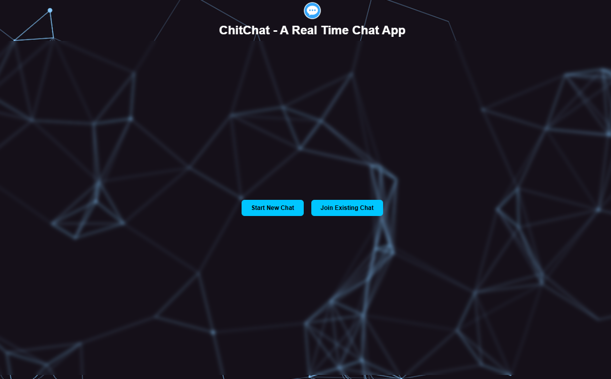
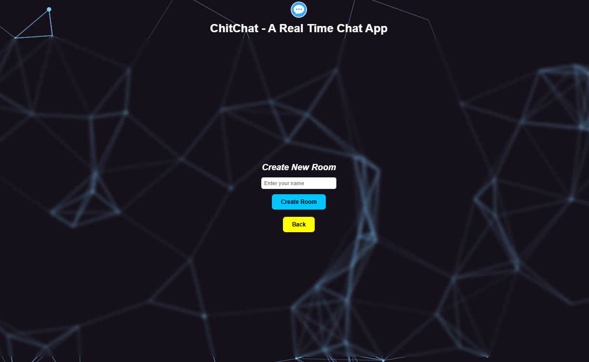
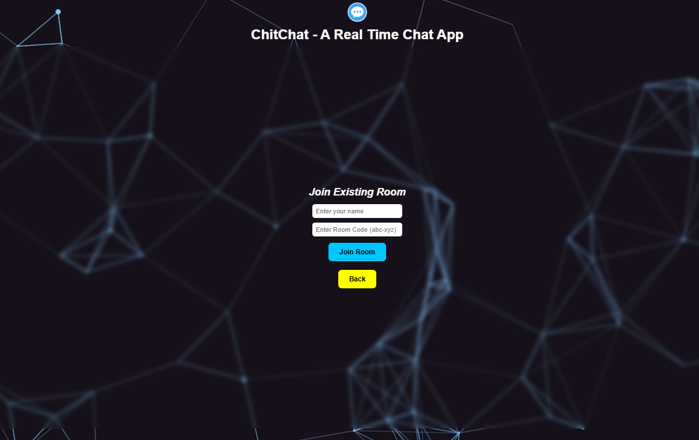
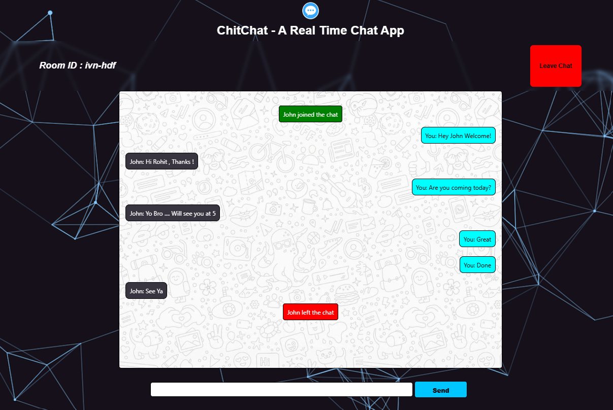

# 💬 ChitChat – Real-Time Room-Based Chat Application

A real-time chat application built using **Node.js, Express, and Socket.IO** that allows users to create private chat rooms using unique 6-letter room codes and communicate instantly.

---

## 🚀 Features

- 🔐 Room-based private chat system
- 🆕 Create new chat room (auto-generated unique code like `abc-xyz`)
- 🔗 Join existing room using room code
- 👥 Real-time messaging using Socket.IO
- 📢 User join/leave notifications
- 📱 Responsive UI
- ⌨️ Auto-expanding message input (WhatsApp-style)
- 🔄 Auto scroll to latest message
- 🛑 Leave room functionality

---

## 🛠️ Tech Stack

- **Frontend:** HTML, CSS, JavaScript  
- **Backend:** Node.js, Express  
- **WebSocket:** Socket.IO  
- **Deployment:** Render  

---

## 📷 Screenshots

> Create a folder named `screenshots` in your root directory and add images there.

### 🏠 Home Screen

### 🆕 Create Room

### 🔗 Join Room

### 💬 Chat Interface

---

## ⚙️ Local Setup Instructions

### 1️⃣ Clone the Repository

git clone https://github.com/your-username/chitchat.git
cd chitchat

### 2️⃣ Install Dependencies

npm install

### 3️⃣ Start the Server

node server.js
Or
if using nodemon:

nodemon server.js

### 4️⃣ Open in Browser
http://localhost:8000

---
**Old instruction for local**

1)Run the live server for index.html file from IDE

2)open terminal 

Run>> nodemon .\index.js

updated >>
npm run dev

---

## 🌐 Live Deployment

This project is deployed on Render.

🔗 Live Link: https://chitchat-lekw.onrender.com/

## 🧠 How It Works

- When a user creates a room, the server generates a unique 6-letter room code.

- The socket joins that specific room.

- Messages are emitted only to users inside that room.

- When users leave and disconnect, the socket automatically leaves the room.

- If all users leave, the room becomes inactive automatically (no manual cleanup required).

## 🔮 Future Enhancements

⏱️ Message timestamps

✍️ Typing indicator

👥 Online user list

💾 Database-based message storage

🔐 JWT authentication

🎨 Modern chat UI redesign

------------

